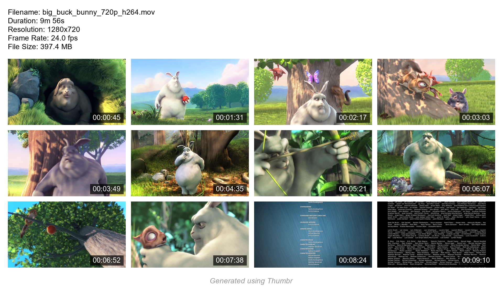

# Thumbr — Video Thumbnail Generator

[](LICENSE)

A Python script that generates thumbnail grids from video files. It automatically captures screenshots from the video and stitches them together into a single image, creating a comprehensive preview with detailed video information and timestamps.

## Features

- Creates a grid of screenshots from any video file
- Customizable grid size (default is 3x3)
- Maintains original video aspect ratio
- Includes detailed video information header:
  - Filename
  - Duration
  - Resolution
  - Frame Rate
  - File Size
- Timestamps on each frame
- Supports various video formats

## Example Output



## Installation

1. Clone this repository or download the files
2. Install the required dependencies:

```bash
pip install -r requirements.txt
```

## Usage

1. Open `main.py` and update the video file path:

```python
video_path = Path("path/to/your/video.mp4")  # Change this to your video file location
```

2. Run the script:

```bash
python main.py
```

The script will automatically:
- Create an output directory if it doesn't exist
- Generate a thumbnail in the output folder
- Add timestamps to each frame
- Include comprehensive video information

## Requirements

- Python 3.6+
- OpenCV (opencv-python)
- NumPy
- Pillow (PIL)

## License

MIT License with Attribution

Copyright (c) [2024] [ilhamazdi]
