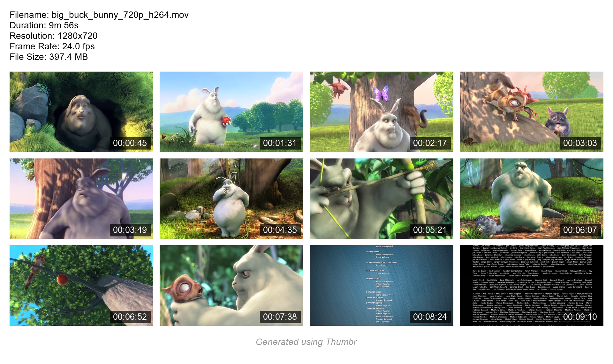

# Thumbr — Video Thumbnail Generator

[](LICENSE)

A Python script that generates visual thumbnail grids from video files. It automatically captures evenly distributed frames from the video and stitches them together into a single image, creating a comprehensive preview with detailed video information and timestamps.

## Features

- **Automated Frame Capture:** Extracts evenly distributed frames across the video's duration.
- **Customizable Grid Layout:** Supports flexible grid sizes (e.g., 3x3, 4x4) for arranging thumbnails.
- **Aspect Ratio Preservation:** Maintains the original aspect ratio of video frames in the thumbnails.
- **Detailed Information Header:** Generates a header with essential video details:
    - Filename
    - Duration
    - Resolution (Width x Height)
    - Frame Rate (FPS)
    - File Size
- **Timestamp Overlays:** Each captured frame is overlaid with its corresponding timestamp.
- **Watermarking:** Adds a customizable watermark to the generated thumbnail.
- **Batch Processing:** Process multiple videos in parallel with intelligent worker allocation.
- **Clean Progress Display:** Single-line progress bar with real-time status updates.
- **Timestamped Output:** Each batch run creates its own timestamped output directory.

## Example Output



## Installation

1.  **Clone the repository:**
    ```bash
    git clone https://github.com/ilhamazdi/thumbr.git
    cd thumbr
    ```
2.  **Install dependencies:**
    ```bash
    pip install -r requirements.txt
    ```

## Usage

Run the `main.py` script from your terminal.

**Process a single video:**

```bash
python main.py "path/to/your/video.mp4"
```

**Process all videos in a directory:**

```bash
python main.py "path/to/videos/"
```

**Process recursively with batch processing:**

```bash
python main.py "path/to/videos/" --recursive --workers 5
```

**Custom output path:**

```bash
python main.py "path/to/your/video.mp4" -o "path/to/desired/output/my_video_preview.png"
```

**Custom grid size:**

```bash
python main.py "path/to/your/video.mp4" -g 4x5
```

**Skip existing thumbnails:**

```bash
python main.py "path/to/videos/" --skip-existing
```

**Verbose mode (detailed progress):**

```bash
python main.py "path/to/videos/" -v
```

## Progress Display

During batch processing, a clean single-line progress bar shows:

```
[████████████████████] 13/13 ✓13 ⊘0 ✗0 ⏱15s video_filename.mp4
```

- `█` - Progress bar
- `✓` - Successful thumbnails
- `⊘` - Skipped (existing)
- `✗` - Failed
- `⏱` - Elapsed time
- Current file being processed

Output is saved to timestamped directories: `output/20260307_064021/`

## Requirements

- Python 3.10+
- `av` - PyAV (FFmpeg-based video processing)
- `numpy` - For numerical operations
- `Pillow` - For image manipulation
- `tqdm` - For progress bars
- `scipy` - For image resizing

## License

MIT License

Copyright (c) 2025-2026 ilhamazdi
